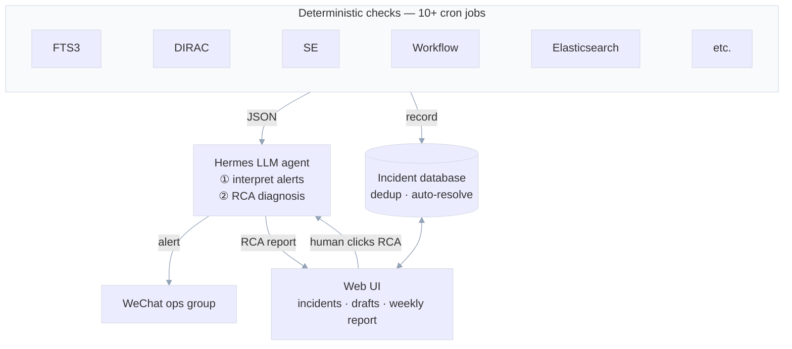
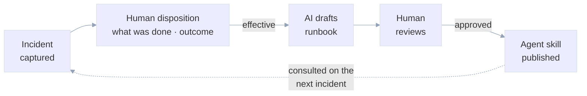

## DCI Deployment and Operations with AI
#### Layered autonomy for AI-assisted operations — a production system at JUNO

 

**Xuantong Zhang** on behalf of the DCI operations team 
<a href="mailto:zhangxuantong@ihep.ac.cn">zhangxuantong@ihep.ac.cn</a>

 

**28th JUNO Collaboration Meeting** · Computing & Software Session · July 2026 · *IHEP, Beijing*

<!--
Timing: 0:30

Good morning. DCI moves tens of terabytes a week between IHEP, CNAF and JINR. This talk is about how we operate it today, with an AI agent working alongside the operators — and the one design rule that makes that safe. Everything in this talk follows from that rule.
-->

---
layout: top-title
color: gray-light
---

:: title ::

# Motivation: DCI is a chain of many systems

:: content ::

<strong>Experiment-specific</strong> 
raw data transfer, job workflows, etc.

↕

<strong>Management</strong> 
DIRAC — workload & data management

↕

<strong>Middleware</strong> 
FTS3 transfers, VOMS / IAM

↕

<strong>Infrastructure</strong> 
CEs, SEs, local resources at IHEP

When one part fails, checking itself is not enough — the root cause often lives in a **different layer**:

- FTS3 reports "FAILED" — the *reason* may be on the SE; DIRAC is blind — the cause may be in VOMS
- Debugging means **tracing across systems**, and every hop costs operator time — heavily dependent on the **maintainers' experience**
- The more DCI grows, the harder this gets — complexity compounds

AI can <strong>reason across</strong> every layer at once — so we brought it in to assist our operations.

<!--
Timing: 0:50

Motivation first. DCI is not one system; it is a chain — experiment-specific services on top of DIRAC, on top of middleware like FTS3 and VOMS, on top of the grid sites and storage elements. When any one part fails, the symptom shows in one layer and the cause hides in another. Tracing that chain by hand is slow, and it gets worse as we add systems. AI is good at watching many things at once — so we decided to bring AI into operations. The rest of this talk is how we did that without losing control.
-->

---
layout: top-title
color: orange-light
---

:: title ::

# The principle: layered autonomy — humans stay in control

:: content ::

<h2 style="font-size:1.1rem; margin:0.2rem 0 0.4rem;">L1 · System observes</h2>

Monitoring illuminates everything, earlier. Human is fully in charge.

<i>e.g.</i> DCI Grafana boards

<h2 style="font-size:1.1rem; margin:0.2rem 0 0.4rem;">L2 · AI advises</h2>

AI speaks, human acts. Advice with evidence, never silent action.

<i>e.g.</i> Root cause analysis · runbook drafts for review

<h2 style="font-size:1.1rem; margin:0.2rem 0 0.4rem;">L3 · Human-approved</h2>

AI prepares the action + evidence chain; human approves each one.

<i>e.g.</i> “Retry a failed transfer” · “Re-submit jobs” — one tap in WeChat or web

<h2 style="font-size:1.1rem; margin:0.2rem 0 0.4rem;">L4 · Bounded autonomy</h2>

Pre-approved whitelist envelope only. **Earned by data, not trust.**

<i>e.g.</i> Auto-retry of transient transfer errors, daily cap, auto-rollback

When AI finds an issue

<!--
Timing: 1:30

THE slide. Borrow the SAE driving-levels idea, but note the axis: not capability — control. Walk the four levels top-left to bottom-right, and give each its DCI example: L1 — Grafana boards and the EOS capacity board; L2 — the EOS RCA example you will see next, and runbook drafts that wait for a human review; L3 — the AI may one day propose "retry this failed transfer batch" or "drain this disk", and a human taps approve in WeCom; L4 — only reversible micro-actions inside a hard envelope, like auto-retry of transient errors with a daily cap. L5 does not exist. And if anyone thinks that is too cautious — Drake has strong opinions about AI silently fixing production at 3 a.m.
-->

---
layout: top-title
color: gray-light
---

:: title ::

# Two design solutions

:: content ::

<h2 style="margin:0.2rem 0 0.4rem;">1 · Detection never depends on the LLM</h2>

Scripts decide what alerts; the LLM only interprets and advises.

<b style="color:#22c55e;">✓ Benefit</b> — no alarm depends on the LLM: worst case is <em>poor wording</em>, never a <em>missed alarm</em>.

<b style="color:#ef4444;">✗ Cost</b> — rules mean <strong>false positives</strong>, and some failure patterns a script simply cannot express.

<b style="color:#3b82f6;">→ Mitigation</b> — false positives shrink as humans mark them (disposition loop); for invisible patterns, the AI's job is to <em>discover</em> them via RCA — then a human codifies the next deterministic check. <strong>New detections are born deterministic.</strong>

<h2 style="margin:0.2rem 0 0.4rem;">2 · Sensitive data never leaks to the LLM</h2>

Logs and error messages are sanitized, size-capped, classified before reaching a prompt.

<b style="color:#22c55e;">✓ Benefit</b> — injection-safe by construction: a crafted log line cannot steer the model.

<b style="color:#ef4444;">✗ Cost</b> — sanitizing <strong>throws information away</strong>; sometimes exactly the clue that matters.

<b style="color:#3b82f6;">→ Mitigation</b> — humans always see the raw, uncensored logs in the UI; a <strong>locally-hosted model</strong> (on our own infra) would let us relax the filters — nothing leaves the room.

<!--
Timing: 0:45

Two corollaries — and both have a price we gladly pay. First: detection never touches the LLM. Benefit: no missed alarms, ever. Cost: more false positives, and patterns a script cannot express. We accept that: humans marking false positives trains the rules over time, and the AI's RCA work is what discovers new patterns — which a human then codifies into the next deterministic check. Second: we sanitize everything the model reads. Benefit: injection-proof. Cost: we sometimes throw away the exact clue. Mitigations: humans always see the raw logs in the UI, and a locally-hosted model on our own infrastructure would let us relax the filters safely.
-->

---
layout: top-title
color: orange-light
---

:: title ::

# System architecture

:: content ::

<strong>Scripts detect</strong> 
never the LLM

<strong>Library remembers</strong> 
dedup & auto-resolve

<strong>Humans decide</strong> 
RCA on demand

<!--
Timing: 1:00

The machinery in one picture. Left: ten scheduled check scripts, all deterministic, covering transfers, DIRAC, EOS, dciTransfer, and a watchdog that watches the scheduler itself. Alerts go two ways at once: to the LLM for interpretation and delivery to our WeCom group, and into the incident library with signature dedup and auto-resolve. The web UI is where humans triage, and where cross-system root-cause analysis lives — triggered on demand, because the human decides when to dig.
-->

---
layout: top-title
color: gray-light
---

:: title ::

# How knowledge accumulates

:: content ::

<strong>Example:</strong>  An operator fixes a recurring transfer failure and records what they did.  Next time the same error fires, the alert already carries that history — and if the fix was marked <em>effective</em>, a runbook draft is waiting for review. <strong>Every fix makes the next one easier.</strong>

<!--
Timing: 0:45

Knowledge accumulation — how operational expertise stops living only in people's heads. An incident is captured; the operator records how they fixed it and whether it worked; if effective, the AI drafts a runbook; a human reviews and approves; it becomes a skill the agent consults next time. The dotted line is the loop closing — the next incident benefits from the last fix. The human is in the loop twice: recording the fix, and approving the runbook. Nothing is published without a human. Example: a recurring transfer failure gets fixed and recorded; next time it fires, the alert carries that history and there is a runbook draft ready. Every fix makes the next one easier.
-->

---
layout: top-title
color: orange-light
---

:: title ::

# Feature: cross-system Root Cause Analysis (RCA)

:: content ::

One click collects evidence across <strong>Infras · DIRAC · Production System</strong> into one ordered timeline — AI produces a four-section report.

<h2>① AI proposes</h2>

Phenomenon  → timeline  → ranked hypotheses (high/med/low confidence)  → verification commands for the human.

<h2>② Human verifies</h2>

Operator checks: correct → confirmed.  Wrong → records what it actually was.  The human stays the judge.

<h2>③ System learns</h2>

Every correction becomes knowledge the system consults next time.  Not one-shot accuracy — a loop that sharpens.

The system is new — we do not claim it is always right. We claim it <strong>gets better with every human correction</strong>.

<!--
Timing: 1:00

First feature: cross-system root cause analysis. When an incident fires, one click pulls evidence from four systems onto one timeline, and the AI writes a structured report — phenomenon, timeline, ranked hypotheses, and verification commands. The key point is not that the AI is always right — it is new, it will be wrong sometimes. The key point is the loop: the AI proposes, the human verifies, and every correction feeds back into the system's knowledge. It gets sharper with use. That is the honest pitch: not accuracy on day one, but a system that learns from your corrections.
-->

---
layout: top-title
color: gray-light
---

:: title ::

# RCA in action — AI proposes, human verifies

:: content ::

Live: four-section RCA report — persisted on the incident

**Example: EOS capacity rollup went critical**

- AI collected evidence from 4 sources, produced ranked hypotheses with confidence levels
- Operator reviewed: **confirmed** the FAILING disk (junoeos09:273)
- **Refined** the capacity hypothesis — operator knowledge corrected the AI's first pass
- Every correction is stored and consulted on the next similar event

Stored on the incident (<code>rca_report</code>) — refresh, reopen, still there.

<!--
Timing: 0:45

Here is a real example. The EOS capacity rollup went critical. The AI pulled evidence from four sources and proposed ranked hypotheses. The operator confirmed one — a genuinely failing disk — and refined another with domain knowledge the AI did not have. That correction is now stored and consulted next time. Notice we are not saying the AI nailed it. We are saying the AI made a first pass, the human made the final call, and the system learned from the difference. Tomorrow our EOS colleagues will verify the full diagnosis.
-->

---
layout: top-title
color: orange-light
---

:: title ::

# Feature: interactive AI assistant

:: content ::

**Ask about any incident in natural language:**

- "What evidence can I collect for incident #369?"
- "Are incidents #369 and #232 related?"

**All information from the incident database is automatically included in the prompt:**

- Full event details (title, summary, RCA report, log samples, dispositions)
- Recent open incidents for context
- Evidence collection paths per system

Powered by the same memory loop — every correction enriches the next answer.

Live: asking about incident #369

<!--
Timing: 0:40

The same knowledge is also available interactively. Ask the AI assistant about any incident — by number, by keyword, by asking what is open — and it answers with evidence paths, RCA context, and related events. It knows the incident library: full details, RCA reports, dispositions, recent open incidents. And because it reads from the same memory loop, every human correction enriches the next answer. This is the pull counterpart to the push reports: you ask, it answers, with the full context of everything the system has learned.
-->

---
layout: top-title
color: orange-light
---

:: title ::

# Feature: noise reduction — merge, don't drown

:: content ::

Operational alerts are noisy — the same failure fires again and again, and similar failures flood the board. We built a <strong>merging layer</strong> so operators see signal, not noise.

**How it works:**

- **Signature dedup** — same problem = one event (×N)
- **Rolling events** for chronic conditions
- **New-crossing detection** — only NEW problems get events
- **Auto-resolve** — condition clears → closes itself

**Operators teach it:**

- Mark false positives, merge similar features
- System learns noise vs. signal
- Accuracy improves with every disposition

<strong>Example — one week of EOS alerts.</strong> Before merging, the board held mostly chronic disk-usage warnings; the cleanup surfaced a genuinely <strong>FAILING disk</strong> that had been drowning in the noise.

<strong style="color:#ef4444;">121</strong> open before &nbsp;→&nbsp; <strong style="color:#22c55e;">18</strong> open after, all actionable &nbsp;·&nbsp; <strong style="color:#3b82f6;">57/504</strong> disks ≥ 97 %

<!--
Timing: 1:00

Second feature: noise reduction. Start with the mechanism, not the example. The problem: operational alerts are noisy — the same failure fires repeatedly, similar failures flood the board. So we built a merging layer: signature dedup collapses repeats into one event, rolling events track chronic conditions, new-crossing detection means only genuinely new problems get individual events, and auto-resolve closes events when conditions clear. Crucially, operators teach the system — they mark false positives and merge similar features, and it learns from every disposition. Now the example: one week of EOS alerts went from 121 open to 18, all actionable — and the cleanup surfaced a genuinely failing disk that had been drowning in the noise. The mechanism first, the payoff second.
-->

---
layout: top-title
color: gray-light
---

:: title ::

# What the cleaned-up board looks like

:: content ::

Live board: rolling capacity event (critical, ×5, with RCA badge), per-disk anomalies, and two <i>new-crossing</i> events detected that morning. The system reports <strong>change</strong>, not <strong>state</strong>.

<!--
Timing: 0:25

This is the live triage board. Note the RCA badge on the rolling event — one glance tells you an analysis exists. And the two newest rows: disks that crossed 97% that morning, flagged as new crossings. The system reports change, not state.
-->

---
layout: top-title
color: orange-light
---

:: title ::

# Feature: periodic operation reports

:: content ::

**Auto-generated daily & weekly operation reports — zero human hours.** Delivered two ways:

- **Web UI** — full interactive report (events, transfers, jobs, trends)
- **WeChat push** — structured summary straight to the ops group

**What's inside:**

- Events: top incidents, dispositions, auto-resolved count
- Transfers: per-site volume, p95 latency, week-over-week baselines
- Jobs: DIRAC success/failure rates
- Trends: capacity & performance anomalies

The format: **brief, structured, actionable** — not a log dump.

WeChat push — DIRAC alert, live today

Web report — same content, web format

<!--
Timing: 0:45

Third feature: periodic operation reports. Daily and weekly, auto-generated, delivered two ways — full interactive report in the web UI, and a structured push to our WeCom ops group. Inside: events, transfers, jobs, trends. Zero human hours to produce. The point is the format: brief, structured, actionable. This is what operators actually read — not a dashboard to interpret, not a log to grep.
-->

---
layout: top-title
color: gray-light
---

:: title ::

# Landscape — where we lead, where we learn

:: content ::

| Work | Approach | Their strength |
|---|---|---|
| CMS Archi CHEP'26 · arXiv:2606.04755 | Q&A assistant: RAG over ~10k docs + live Rucio/Condor tools | **RAG knowledge retrieval at scale; live-tool integration** |
| CERN IT LLM fault mgmt CHEP'26 · Indico #6966808 | LLM selects remediation actions from a bounded set | **Autonomous remediation with control & observability** |
| WLCG perfSONAR CHEP'26 · Indico #6966480 | Per-corridor baselining for routing anomalies | **Mature baselining + impact-vs-routine triage** |
| ATLAS/CMS OpInt Front. Big Data'21 · doi:10.3389/fdata.2021.753409 | ML classifiers for job failures & error clustering | **Production-hardened feature engineering** |
| **JUNO DCI (this work)** | Event-loop-driven ops memory + layered autonomy (L1–L4) | incident library · cross-system RCA · auto-resolve · learning loop |

<strong>We have (in production):</strong>
<ul style="columns: 2; font-size: 0.78rem; margin: 0.3rem 0 0; line-height: 1.35;">
<li>deterministic detection</li>
<li>incident library (dedup · auto-resolve)</li>
<li>cross-system RCA + verification commands</li>
<li>noise reduction with human participation</li>
<li>periodic reports (web + WeChat)</li>
<li>layered-autonomy framework</li>
</ul>

<strong>We lack (yet):</strong>
<ul style="columns: 2; font-size: 0.78rem; margin: 0.3rem 0 0; line-height: 1.35;">
<li>RAG retrieval over runbooks</li>
<li>bounded remediation actions (L3 designed, not built)</li>
<li>triage-class severity refinement</li>
<li>RCA latency 1–2 min (async by design)</li>
<li>draft quality varies → human review gate</li>
</ul>

<!--
Timing: 1:00

The honest landscape, table form. Bold marks what each project does best. Archi owns RAG at scale; CERN IT is furthest into autonomous remediation; WLCG has the most mature baselining and triage; OpInt has years of production feature engineering. Our row: event-loop-driven, with an incident library, cross-system RCA, auto-resolve, and a learning loop — live in production. What we have vs. what we lack is on the bottom: RAG retrieval and bounded actions are next; the framework to hold them is already here.
-->

---
layout: top-title
color: orange-light
---

:: title ::

# Future plan — horizontal: widen the loop

:: content ::

<h2 style="font-size:1.05rem; margin:0.1rem 0 0.25rem;">RAG knowledge service — closes a gap</h2>

Index approved runbooks, dispositions, and docs → natural-language query over ops memory. Embeddings + vector store <strong>on our own infra</strong> — nothing leaves the room.

<h2 style="font-size:1.05rem; margin:0.1rem 0 0.25rem;">More log sources, same contract</h2>

HTCondor node logs · <strong>overseas site</strong> (CNAF/JINR) compute & storage logs · other DCI systems — from native logs <strong>and Elasticsearch</strong>. Same contract: <em>checks in, JSON out, memory in the middle</em>.

<h2 style="font-size:1.05rem; margin:0.1rem 0 0.25rem;">Smarter severity</h2>

Grade alerts by <strong>real impact on data flow</strong>, not just error count — a one-off transfer halt should outrank a disk that has sat at 97% for weeks. Fewer pages, every one worth reading.

<strong>An invitation:</strong> the loop is system-agnostic — checks in, JSON out, memory in the middle. <strong>Bring your own service.</strong>

<!--
Timing: 0:55

Horizontal plan, and it directly closes the gaps we just admitted. First: RAG over our own runbooks and dispositions, hosted on our own infrastructure — the memory becomes queryable in natural language. Second: more sources — HTCondor, overseas sites, other DCI systems, from native logs or Elasticsearch — all through the same contract: checks in, JSON out, memory in the middle. Third: smarter severity — right now we grade by error count, so a chronic 97% disk and a sudden transfer halt can look equally urgent; we want to grade by real impact on data flow instead, so the few pages that go out are all worth reading. Nothing here is a new architecture — it is the same loop, wider.
-->

---
layout: top-title
color: gray-light
---

:: title ::

# Future plan — vertical: earning L3 and L4

:: content ::

<h2 style="font-size:1.05rem; margin:0.1rem 0 0.25rem;">L3 — human-approved maneuvers</h2>

WeChat approval cards: proposed action + <strong>evidence chain</strong> + one-tap approve/reject.  <strong>Audit table first</strong> — every proposal, decision, outcome persisted.  First candidates: <em>retry a failed transfer batch</em>, <em>restart a stuck service</em>.

<h2 style="font-size:1.05rem; margin:0.1rem 0 0.25rem;">L4 — bounded autonomy</h2>

Small whitelist of reversible actions, each with a hard envelope: when it may fire, how often, and automatic rollback.

<strong>Gate:</strong> the incident library must accumulate enough dispositions to prove which actions are safe. Data earns autonomy — not confidence.

<!--
Timing: 0:55

Vertical plan. L3: the AI may prepare an action, but the card a human receives carries the full evidence chain, and every decision lands in an audit table — first candidates are retrying a failed transfer batch and draining a flagged disk. L4, later: a small whitelist of reversible actions with hard envelopes and automatic rollback. The gate between them is not engineering effort — it is evidence. The library has to prove the action is safe before we let go of the button.
-->

---
layout: top-title
color: orange-light
---

:: title ::

# Summary

:: content ::

1. **DCI is a chain — the fix must cross systems too.** One click gathers evidence from FTS3 · DIRAC · grid-data · EOS; AI proposes a first hypothesis, humans verify, and <strong>every correction sharpens the next one</strong>.

2. **Autonomy is layered; detection stays deterministic.** L1 observe · L2 advise · L3 approve · L4 envelope. A weak model means poor wording, never a missed alarm.

3. **A loop with memory beats a monitor.** Signature dedup · auto-resolve · noise reduction with human participation · periodic reports to your phone — and a knowledge base that grows with every disposition.

L1 + L2 are <strong>live in production</strong> today — not claiming day-one accuracy, claiming a system that <strong>learns from your corrections</strong>. Next: widen the loop (RAG, more sources) and earn L3/L4 with evidence. <strong>Come and see it.</strong>

<!--
Timing: 0:35

Three sentences to take home. DCI is a chain, so the fix crosses systems — and the AI gets sharper with every human correction. Autonomy is layered and detection stays deterministic. And a loop with memory beats a monitor. The system is running today; we are not claiming it is perfect, we are claiming it learns. Next up: widen the loop, then earn the right to act. Come and see it.
-->
